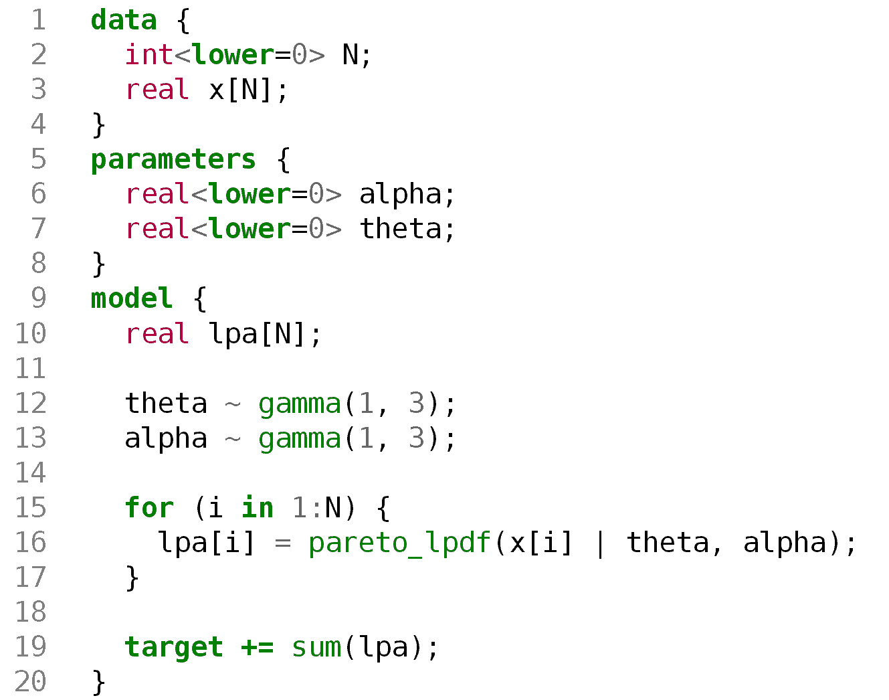

## Quantifying uncertainty in Pareto estimates of global lake area

[](https://doi.org) [](https://doi.org/10.5281/zenodo.7459226)

Code and data for the publication:

> **Stachelek, J.**, *Under Revision* Quantifying uncertainty in Pareto estimates of global lake area.

### Products

Manuscript: [manuscript/manuscript.pdf](manuscript/manuscript.pdf)

Stan model: [pareto_model.stan](pareto_model.stan)



### Reproducibility

```shell
conda create -n paretolakes
conda env update -f environment.yml
source activate paretolakes
Rscript -e "install.packages(c('tidybayes', 'cowplot'), repos='https://cloud.r-project.org')"
```
